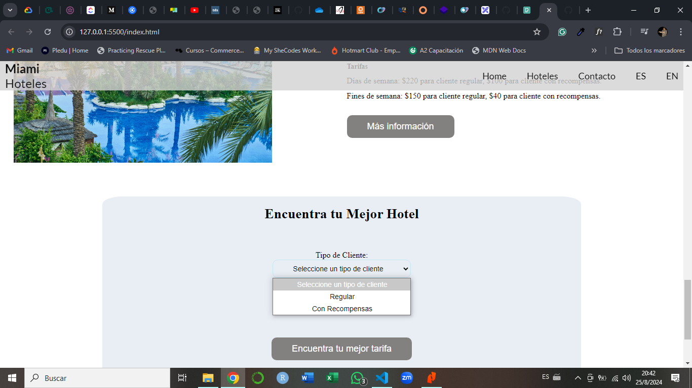

## Aplicación para encontrar el mejor precio por fecha

#Escenario:
Una cadena hotelera en Miami desea ofrecer servicios de reservación de habitaciones por internet. La cadena tiene tres hoteles: Lakewood, Bridgewood y Ridgewood. Cada hotel tiene tarifas diferentes para días de semana y fines de semana (sábado y domingo). Hay tarifas especiales para clientes con recompensas como parte del programa de lealtad. Cada hotel tiene una calificación asignada. 

• Lakewood: 
o Calificación: 3 estrellas 
o Tarifas: 
▪ Días de semana: $110 para cliente regular, $80 para cliente con recompensas. 
▪ Fines de semana: $90 para cliente regular, $80 para cliente con recompensas. 

• Bridgewood: 
o Calificación: 4 estrellas 
o Tarifas: 
▪ Días de semana: $160 para cliente regular, $110 para cliente con recompensas. 
▪ Fines de semana: $60 para cliente regular, $50 para cliente con recompensas. 

• Ridgewood: 
o Calificación: 5 estrellas 
o Tarifas: 
▪ Días de semana: $220 para cliente regular, $100 para cliente con recompensas. 
▪ Fines de semana: $150 para cliente regular, $40 para cliente con recompensas. 

#Requerimientos:
Mostrar unn “toggle” para permitir al cliente seleccionar entre regular y con recompensas.

